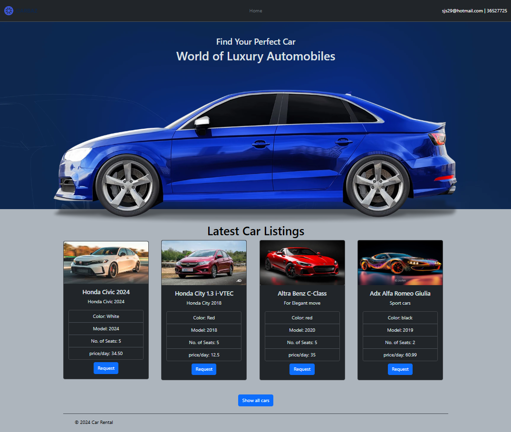

# Car Rental MEN-CRUD System

## About this Car rental system

This Car Rental Booking System is a simple online reservation system which provides the basic tools and features needed to run a car rental business. It provides a simple, step-by-step booking process, and a simple backend administration.

## Intro to my system

With the basic functionality on the system, users in frontend can view, read and request a car to rent, the backend administration can view, update, suspend or delete a car, category or users, can approve or reject car rental requests. add, update, delete or suspend admins or agents to the system.

Although there are some things I was not able to implement them - for any reason - we can add some more features and ideas in future. this implementations couldn't be implemented so far due to the short schedule and some personal urgent matters I faced during project time.

_Some suggested examples of improvements/ideas for the game:_

- Implement a functionality to send approval letters/messages to users in email, SMS or whatsapp.
- Implementation the reports of each main part of the system (agents reports, car reports, categories report, payments reports ... etc).
- Implementing the search functionality in frontend.
- Re-design the system showing to best practice GUI.
- activate the functionality of renting starting rented car and returned status report.

## Getting Started

### 1. Prerequisites

Since the system is a **MEN** system, so **no hardware** prerequisites needed and **no required specific software** for the frontend installations. Just a supported - latest version - browser, view the system. for backend there should be a MongoDB connection for saving the data!

### 2. View the system

[link to the system repo](https://smizal.github.io/ludo-game/)

### 3. System coding libraries

the system coded with the following technologies and libraries

- MongoDB
- Express.js
- Node.js
- bcrypt
- dotenv
- ejs
- express-session
- method-override
- mongoose
- multer
- bootstrap
- javascript

## Acknowledgments

It's my time to give a BIG THANKS to all my supportive teachers, my wonderful colleagues and other kind persons who shared their opinions with me from choosing my project to the end of submitting it and achieving the goal of developing and coding this system during this project days. It was a real challenge for me. For that I'll be always grateful :)
